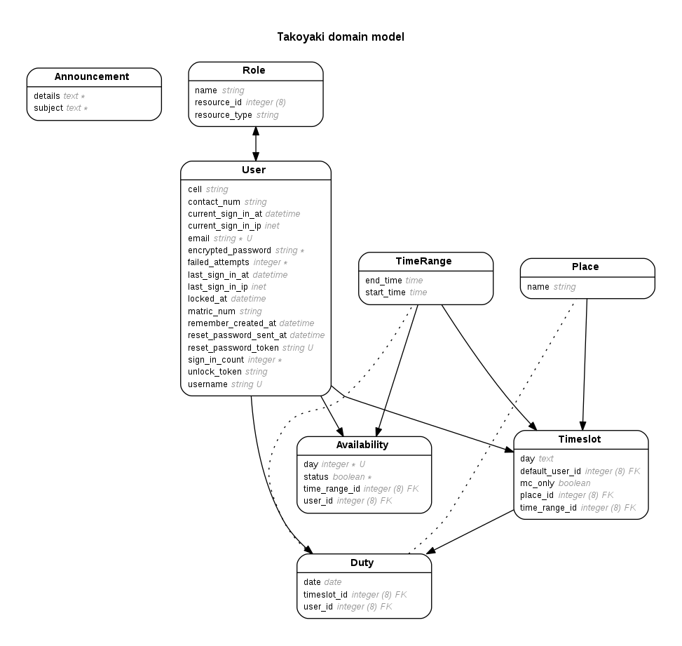

# takoyaki
NUSSU commIT Duty Website, iteration 4

## Entity-Relationship Diagram

### Generate ERD
To generate the current Entity-Relationship Diagram, install `graphviz` (`sudo apt install graphfiz` or `brew install graphfiz`),
then run `rake generate_erd`. This is also run as a post-migration hook

